autoscale: true  
slidenumbers: true  
theme: Next, 3

# [fit] How to make a cute 
# [fit] Pull Request[^*]

<br/>

```swift
let author = "Konstantin Portnov"
let github = "github.com/x0000ff"
```

<br/>


[^*]: the Octobi Wan Catnobi (c) https://octodex.github.com/octobiwan

---


---

# What is Pull Request?

---

# From Pull Request 
# I expect...
## 3 things


---

# From Pull Request I expect...
## ✅ No bugs


^ Run tests locally, Configure CI

---

# From Pull Request I expect...

## 👶 Easy Code Review

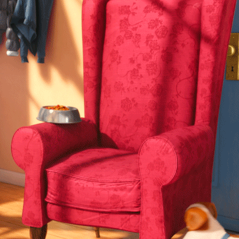

---

# From Pull Request I expect...

## 📗 Documentation


---

# 🤓 Commits matter

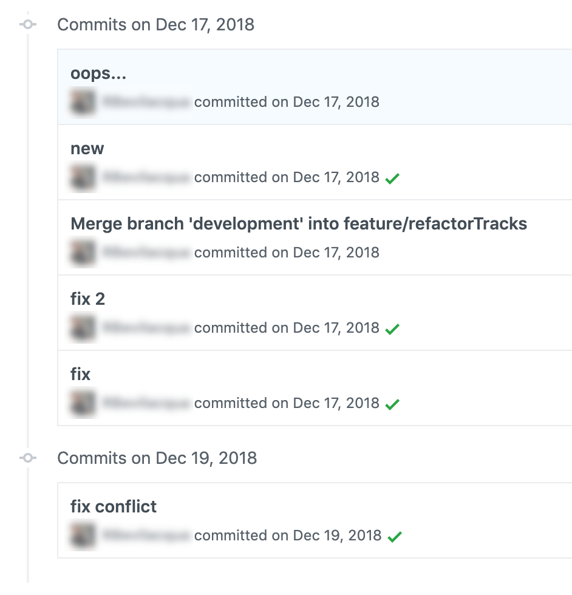

^ Rebase

---

# 🐙 Single Responsibility

- Easy to review
- Easy to revert
- Clear history

---

# Size
# 👶

---

# 💩 Names matter

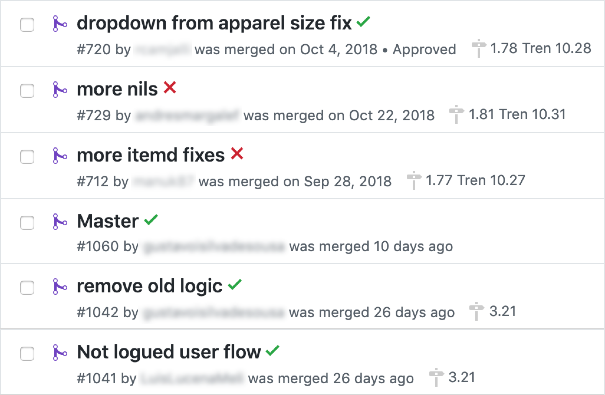

---

# 💩 Names matter

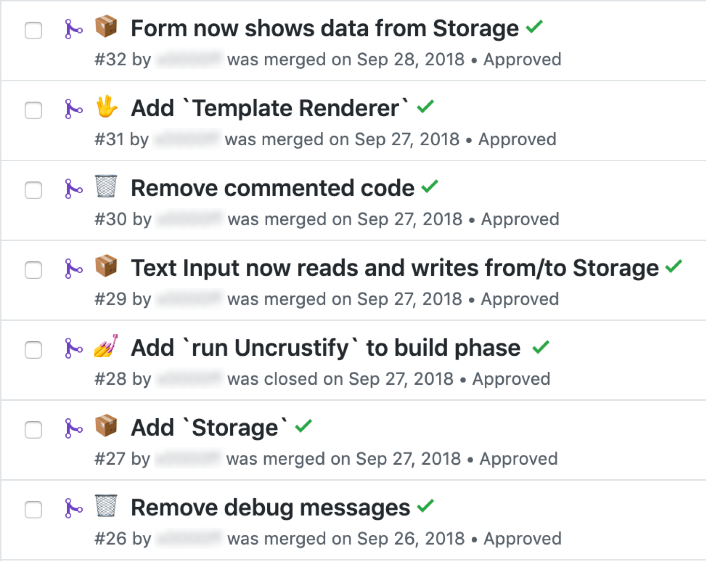

---

# Description	
# 📗	

--- 

# Do you have a documentation?
# 🤷‍♂️ 

---

# 🧐 It's about...

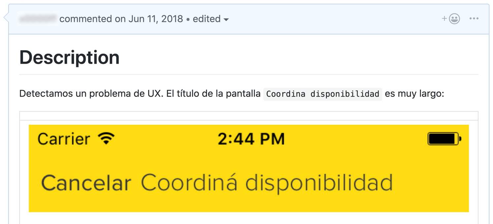

---

# 👩‍🎨 Visual part

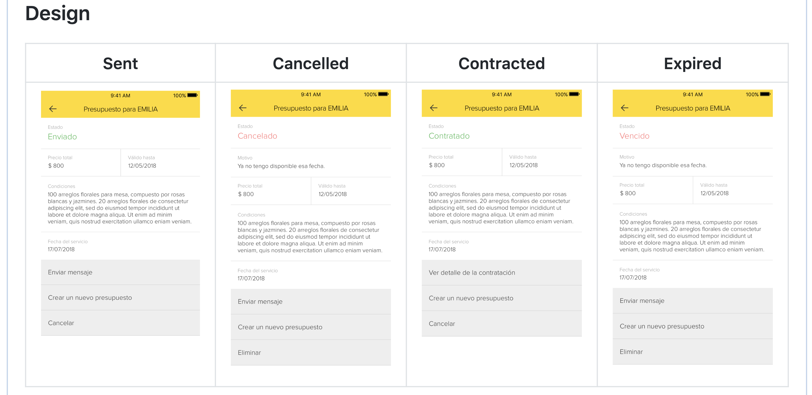

---

# 🎭 Compare

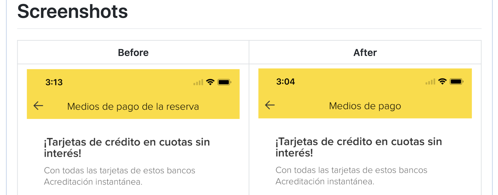

---

# 🎬 Gifs 

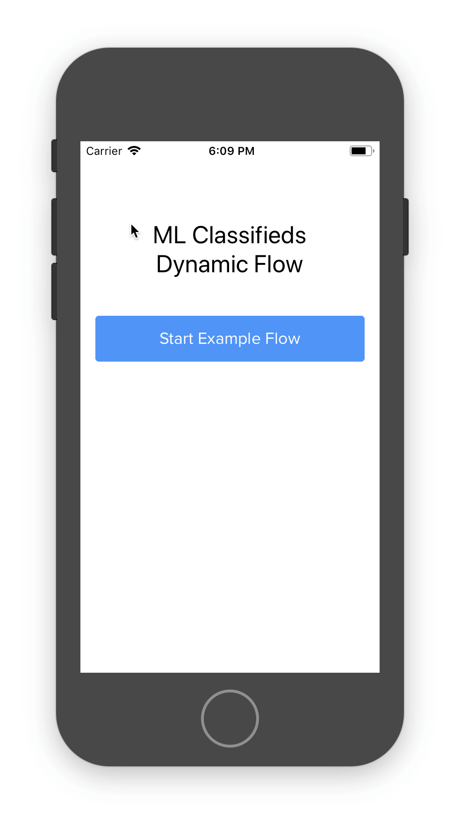

---

# 📦 JSON

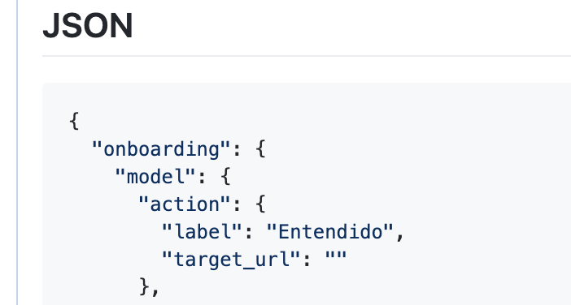

---

# 📦 JSON + `<details>` html tag 

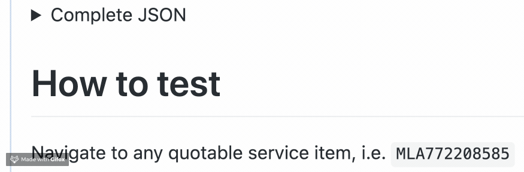

---

# 📦 JSON + `<details>` html tag 

```html
<details>

<summary>Complete JSON</summary>

` ` `json
{
  "main_info": { }
} 
` ` `

</details>
```

---

# 🌐 Wording

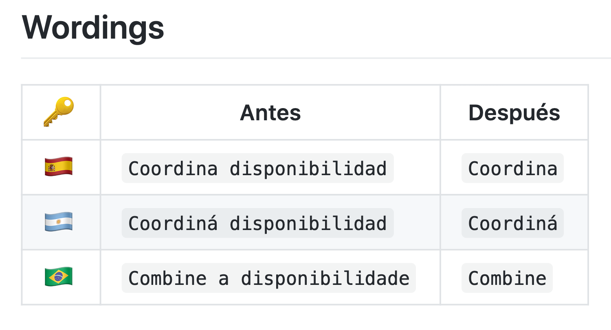

---

# 🚀 Milestone, release date...

---

# 🛠 Fix

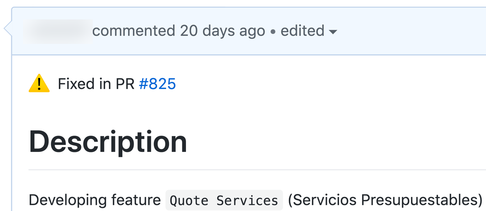

---

# 🛠 Fix

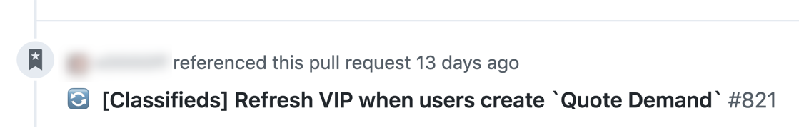

---

# 🤝 Conterparts?
	
- Android
- iOS
- Backend 

---

# How to test

- Mock: i.e. mocky.io


---

# How to test

- Patch
- See `$ git apply <patch>`

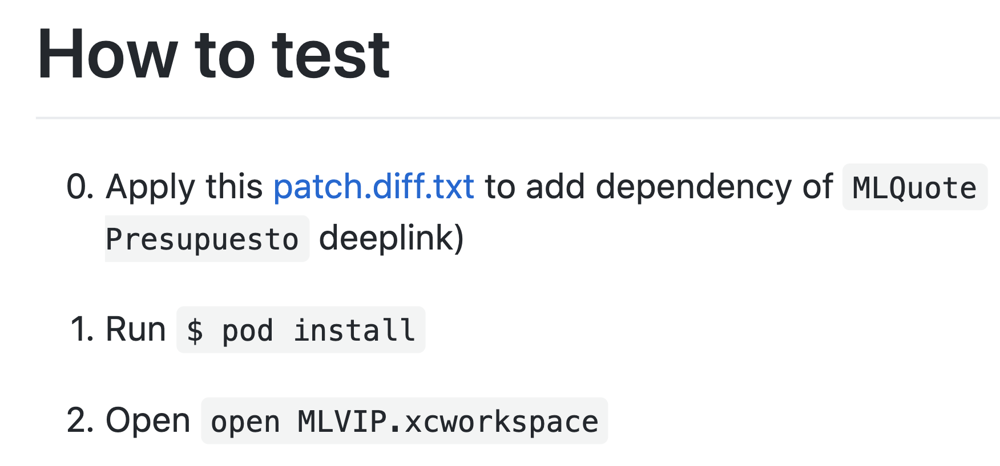

---

# How to test

- Steps to reproduce
- Before / After / Expectations

---

# 🎉 Fin

---

# 🤔 Q & A

---

# ☺️ Thanks a lot!


---

# **Me...**


-  Konstantin Portnov 

-  [http://about.me/x0000ff](http://about.me/x0000ff)

-  [https://github.com/x0000ff](https://github.com/x0000ff)

-  [https://twitter.com/x0000ff](https://twitter.com/x0000ff)

-  [https://www.linkedin.com/in/KonstantinPortnov](https://www.linkedin.com/in/KonstantinPortnov)

---

# This Presentation
# 🙂
# `http://bit.ly/`
# `2JPWTuK`

---

# EOF
# 🍻